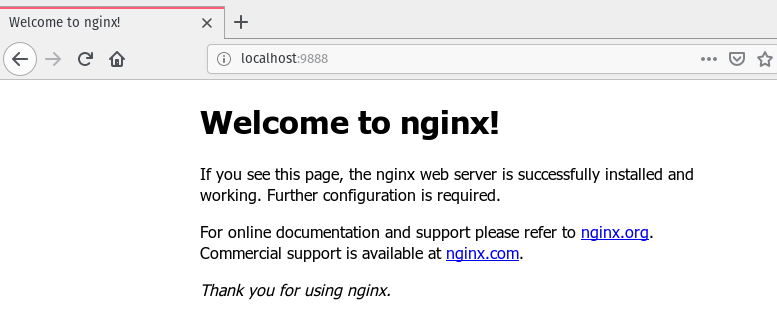

# Exercice 2

## Démarrer une image NGINX en mode daemon

```bash
docker container run --rm --name=tp-nginx -p 9888:80 -d nginx:latest
```

Ce qui fonctionne très bien :



## Récuperer les logs dans le container

On se connecte à une session bash dans le container:

```bash
docker exec -it tp-nginx bash
```

et on essaye d'accéder aux logs :

```bash
cat /var/log/nginx/access.log
```

Sauf que ça ne fonctionne pas puisque les logs sont gérés par le Docker daemon. Pour y accéder il faut le faire depuis la machine hôte :

```bash
docker logs tp-nginx
```

et là on obtient tous les logs attendus.

## Sortir du container et le supprimer

Comme j'ai créé le container avec le flag `--rm`, j'ai juste à l'arrêter pour qu'il soit supprimé.

```bash
docker container stop tp-nginx
```