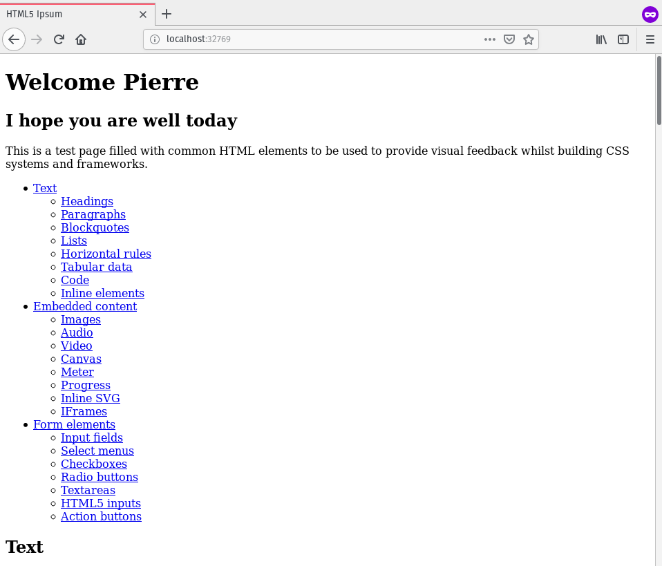
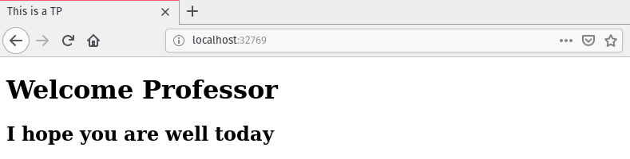

# Exercice 3

## Vérifier que l'image expose bien le port 80

On sait déjà que l'image expose le port 80 puisque l'exercice précédent a bien réussi à faire une redirection de port sur le port 9888 de l'hôte. Cependant pour avoir la conscience tranquille on peut aller consulter le Dockerfile sur DockerHub.

Dans le [Dockerfile référencé comme celui correspondant au tag `latest`](https://github.com/nginxinc/docker-nginx/blob/7890fc2342613e6669ad83ceead9c81136d2cc0a/mainline/stretch/Dockerfile) on trouve bien la ligne

```Dockerfile
EXPOSE 80
```

## Monter un dossier de l'hôte dans le container

On crée le dossier demandé contenant un document `index.html`.

Puis on relance un nouveau container, mais avec cette fois-ci la commande agrémentée de l'option `-v`

```bash
docker container run --rm --name=isenweb -v $(pwd)/public_html:/usr/share/nginx/html -p :80 -d nginx:latest
```

On trouve le port attribué par docker avec `docker ps`



## Modification et hot-reloading

Je modifie le titre et le premier `h1` du fichier et je recharge la page


